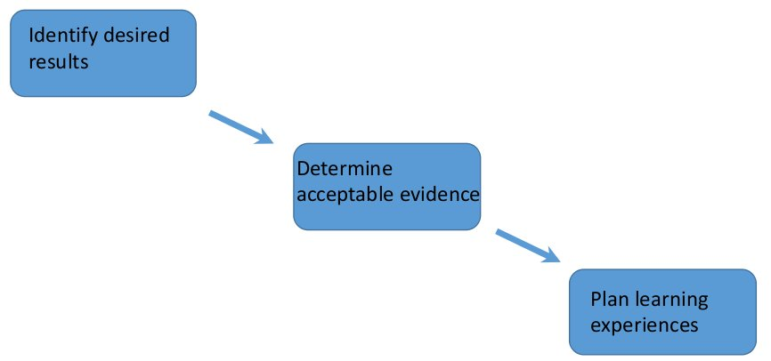

# Discussion

## Benefits of our framework

The student test cases for our framework demonstrated greater 
self-confidence and greater proficiency in data science skills over the 
course of the research projects. They used real-world data sources to 
address real scientific research questions.
Additionally, they showed great interest
in quantitative and data science careers. After graduation, one student immediately enrolled
in statistics graduate training, while the other sought employment in 
health care analytics.


## Critiques of our framework

From our current perspective, we offer a number of framework critiques and opportunities for improvement. Our measure of students' self-confidence in research ability was merely subjective. In 
future iterations of our framework, we would like to measure systematic and objective 
outcomes. One strategy for implementing this is to administer a survey, including questions from @vance2017eight, 
both before and after the mentored research project. We would use survey 
questions that focused on student beliefs about themselves, their skills, and their 
future careers.

One shortcoming of our initial framework was the relative lack of emphasis 
on best practices for 
computational reproducibility. This is one area that we would like to 
rectify in 
future mentoring activities. The university has periodically offered a semester course 
in best practices for 
computationally reproducible research. We 
especially see collaborative 
version control systems, such as Git and 
Github, as essential tools for the modern data scientist.


### Framework development with backward design

In future research, we will continue to develop our framework for 
undergraduate data science research by explicitly 
incorporating backward design principles [@wiggins2005understanding]. 
Following @wiggins2005understanding, we will identify desired results, 
determined acceptable evidence, and planned learning experiences. 

```{r backward, echo = FALSE}

```

Before identifying desired results, we will prioritize topics from 
@nolan2010computing. Specifically, we will assign all terms from Figure 1 
of @nolan2010computing into one of three categories: 

1. worth being familiar with 
1. important to know and do
1. enduring understanding

We've tabulated below the @nolan2010computing terms for the current 
framework and its student projects.

```{r table1, echo = FALSE, message = FALSE}
library(magrittr)
circles <- tibble::tibble(Class = 1:3, Circle = c("Worth being familiar with", "Important to know and do", "Enduring understanding"))
readr::read_csv("../data/nolan-figure1-circles.csv") %>%
  dplyr::left_join(circles) %>%
  dplyr::arrange(desc(Class)) %>%
  dplyr::select(- Class) %>%
  gt::gt() %>%
  gt::tab_header(title = "Prioritizing Key Terms from Figure 1 of @nolan2010computing", 
                 subtitle ="xxx" ) %>%
  gt::as_latex()
```

Potential benefits of incorporating backward design ideas include clearer 
articulation of goals and better assessment of goal achievement.

We see our framework as one contribution to scholarship on improving data 
science training programs. Given the increasing economic need, in the USA 
and abroad, for 
data scientists and other researchers with quantitative training, we 
anticipate that our framework and its future iterations will continue
to prepare students for data science careers by offering training in tangible and 
transferable analytic skills in the context of solving scientific questions.

## Integrating more mentoring activities

Our framework would benefit students more if we explicitly incorporate more 
mentoring activities. Through professional development courses at the university, we received training in how to offer 
professional support to students. While we both informally supported our
students, the professional development program suggested
ways to encourage the student's professional development through structured
conversations and goal-setting. Additions like this would only enhance our 
framework. 


@baker2010beyond discuss the role of faculty "developers" in 
student success. A faculty "developer", as envisioned by @higgins2001reconceptualizing, 
offers not only psychosocial and career support, like a mentor, but also 
supports students' academic goals. Such relationships between developers 
and students benefit both parties. The student gets support while the 
developer refines her teaching and expands her scholarly network. We anticipate
expanding our framework to more holistically support students.


