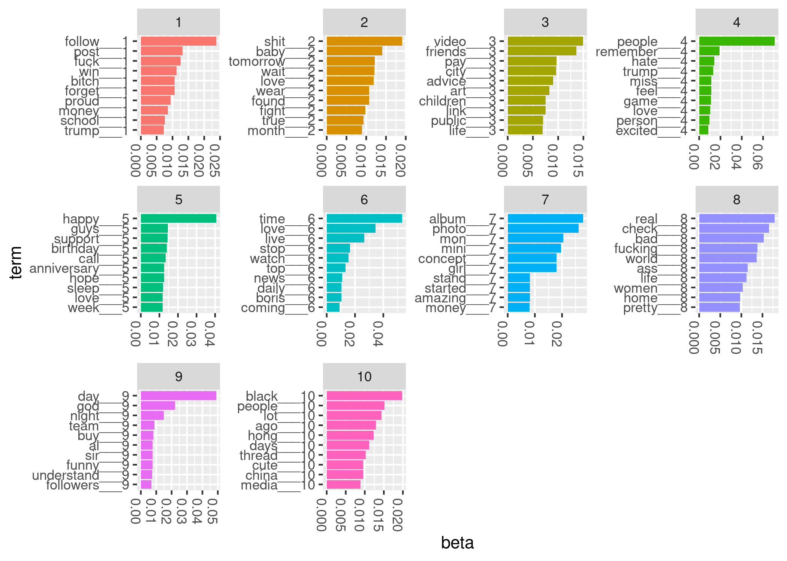
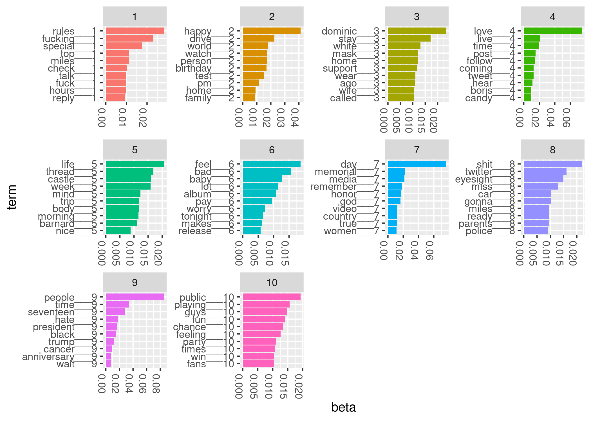
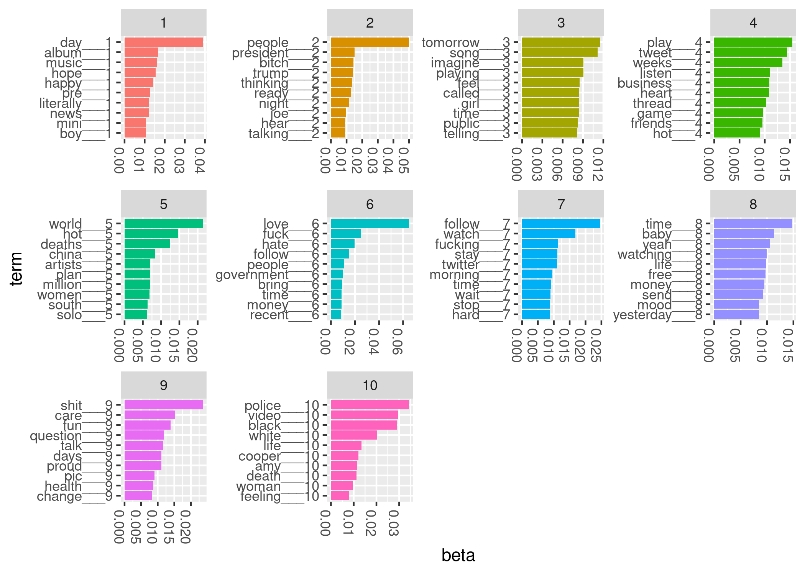

```{r child = "abstract.Rmd", eval = TRUE}
```

```{r setup, echo = FALSE}
knitr::opts_chunk$set(echo = FALSE)
```

# Introduction

Twitter has profoundly changed how we communicate. 
In only 280 characters, users instantly contribute to public conversations on politics, 
current events, sports, media, and many other topics. 
Recent development of accessible statistical methods for large-scale text 
analysis now enable instructors to use tweets as contemporary pedagogical 
tools in guiding undergraduate research projects.
We guided two statistics students in their senior research projects. 
Both students used tweets to address novel research questions. We 
share products of their research in supplementary files. Because 
their data are no longer available, we present as a case study one 
analysis with tweets from May 2020. We share our data and computer 
code to encourage others to undertake 
tweet text analysis research. We also describe methods for creating a 
collection of tweets.

Some social media data, including tweets from Twitter, is
available through website application product interfaces (APIs). 
By way of a streaming API, Twitter shares a sample of approximately 
one percent of all 
tweets during an API query time period [@tweet_stream]. Any Twitter 
user can freely 
access this one percent sample, whereas access to a larger selection is available to researchers for a fee.


Studies of Twitter conversations have yielded valuable insights into 
modern culture. Using large collections of tweets, scholars have 
investigated diverse research questions, including
the inference of relationships and social networks among Twitter users [@lin2011joint]; 
authorship of specific tweets when multiple persons share a single account [@drob]; and 
rhetoric in recruiting political supporters [@pelled2018little;@wells2016trump].
Recognizing the potential utility of tweets for data science research and teaching, 
we created a collection of tweets over time by repeated querying of the Twitter streaming API.

In line with recent calls for students to work with real data [@nolan2010computing;@carver2016guidelines], our 
collection of tweets has served as a valuable resource in our mentoring 
of undergraduate data science research. 
Working with real data allows students to develop proficiency not 
only in statistical analysis,
but also in related data science skills, including data 
transfer from online sources, data storage, using data 
from multiple file formats, and communicating findings. 
Collaboratively asking and addressing novel questions with 
our collection of tweets gave mentored students 
opportunities to develop competency in all of these areas.


While our tweet collection enables us to address many possible research questions, the 
dynamic content of tweets over time particularly piqued our interest. 
We hypothesized that high-profile social media events would generate a high volume of 
tweets, and that we would detect social media events through changes in tweet 
topic content over time. We discuss in detail below one approach to studying this
question. In the sections that follow, we detail our backward design-inspired approach to 
writing learning objectives, preliminary research mentoring considerations, 
data science methods for collecting and analyzing tweets, analysis results, 
and ideas on assessment and advanced topics.


# Backward design and learning objectives

## Backward design

Backward design principles guided our planning and informed the writing of
learning objectives [@wiggins2005understanding]. Following @wiggins2005understanding, 
we began by listing 
what students, at the end of their thesis research, should be able to do, 
understand, and know. We then classified each of these items into 
one of three categories: enduring understanding, important to know and do, 
and worth being familiar with [@wiggins2005understanding] (Table \@ref(tab:circle-table)). 
Nearly all of the skills in Table \@ref(tab:circle-table) are 
transferable. They apply not merely to thesis projects, but also to
data science research in general.


```{r, circle-table, echo = FALSE, message=FALSE}
library(magrittr)
readr::read_csv("../data/concepts-backward-design.csv") %>%
  knitr::kable(caption = "Classifying project skills")
```


## Learning objectives

We translatedour prioritized list of skills that 
students should be able to do, understand, and know into learning objectives (Table \@ref(tab:circle-table)). 
We phrased learning objectives in a manner that enabled their subsequent assessment 
(Table \@ref(tab:summative)) with formative and summative strategies. These were 
our four learning objectives:

1. Write R code to perform text analysis of large volumes of tweets [@r].
1. Communicate results in a written report and poster presentation.
1. Translate statistical findings into scientific conclusions.
1. Develop data science strategies to address a scientific research question.


# Preliminary research mentoring considerations

We developed research goals with students in a series of discussions. As trainees began their senior research projects, we spoke in detail about both their research interests and goals and their experience with data analysis software.

Student experience with statistical software varies. In our statistics department, 
most students learn elementary R computing skills through class assignments. Some 
students, by concentrating in computer science, learn other data analysis software 
packages, such as Python. 
Those who do undergraduate statistics research often learn advanced topics in R
computing, such as R package assembly, documentation, and testing. Many develop 
expertise in linux computing and cluster computing, too. 

One of our two students had extensive experience in statistical computing. In 
addition to R computing skills, she also worked in Python and excelled in shell scripting. 
She first learned Python in computer science courses. Our second student had 
extensive experience with R from his statistics courses. His background 
enabled him to write an R package as part of his senior project. 


Our data science projects required that students possess elementary R computing
skills. We guided students towards supplementary R computing resources, including 
the online books "R for Data Science" [@wickham2016r] and "Advanced R" [@wickham2019advanced].


## Student research interests and goals

Student interests vary, and students' ability to articulate research goals 
may be limited. An initial brainstorming session may clarify their interests and encourage 
them to think critically about goals under the time constraints of their academic schedules. 
Additionally, we anticipate that sharing completed student project reports will guide student 
thinking about the scope of possible projects (Supplementary files).

We briefly describe the two student projects to give readers a better sense of research possibilities with tweets. Our first student examined relationships over time between 
stock market index prices and tweet sentiment. For each day in her 12-month study period, 
she identified stock market-related tweets with a key word search. With the complete
texts of stock market-related tweets for each day, she calculated a daily sentiment score and plotted it over time. 
Her sentiment score reflected presence of emotion-associated terms (eg., "happy", "sad", "mad", "scared") 
in tweet texts. Days with more net positive emotion words in the collected tweets received a higher (positive) daily sentiment score, while days with more net negative words received a negative daily sentiment score. 

For her final project, she presented plots over time of her daily sentiment scores and daily closing prices of the Standard and Poor's 500 index. She also explored time series analysis methods to quantify relationships between closing index prices and sentiment scores. 


## Time period

Our two statistics students conducted their research projects during the 2015-2016 academic year. 
We recommend a full academic year for projects of this magnitude, although a one-semester 
project is possible. Our students presented their findings at the statistics department’s 
undergraduate poster session near the end of the 2015-2016 academic year (Supplementary files). We present below reproducible R code for analyzing data from May 2020. While these
are not the same data that our students analyzed in 2015, the methods and code 
are very similar.


# Case study methods

To illustrate the value of Twitter data, we present below a 
reproducible case study. It is essentially a reproduction of our second student's project, but at a 
distinct time period. In it, we aim to detect a social media 
event by examining topic content over time. We use Latent Dirichlet 
Allocation (LDA) models [@blei2003latent] to infer topics on three consecutive days centered 
on Memorial Day 2020. We chose this example case study, 
instead of the student projects, because of limited data 
availability for the student projects. Despite this, the case study 
illustrates the strategy and methods for one of the student 
projects. 

## Case study design

We sought to validate our hypothesis that we could detect a social 
media event by examining tweet topic content at distinct time periods. 
As a proof of principle of our event detection strategy, 
we analyzed tweets before, during, and 
after Memorial Day (May 25, 2020). 
We fitted latent Dirichlet allocation models for each of three
distinct five-minute periods. The first period began at noon Eastern time 
on May 24, 2020. Subsequent time periods started 
24 and 48 hours later. 
We defined each time period to be a single collection, or corpus, of 
tweets. 


## Collecting tweets over time

We include here instructions for creating a tweet collection. First, we created a 
new account on Twitter. With these user credentials, we used the 
R package `rtweet` to query the API. We used the linux `crontab` software 
to repeatedly execute R code to submit API queries. Each 
query lasted five minutes and produced a text file of approximately 130 MB. We timed the API queries so 
that there was no time lag between queries. We stored tweets resulting from API queries in their native JSON format. 

Setting up the query task with `crontab` is straightforward. On our computer, with 
Ubuntu 20.04 linux operating system, we opened a terminal and typed `crontab -e`. This 
opened a text file containing user-specified tasks. We added the following line to the 
bottom of the file before saving and closing the text file.

```{bash, eval = FALSE, echo = TRUE}
*/5 * * * * R -e 'rtweet::stream_tweets(timeout = (60 * 5), 
parse = FALSE, file_name = paste0("~/work/mentoring/mentoring-framework/data/",
lubridate::now(), "-tweets"))'
```

Readers may need to slightly amend the above line to conform to requirements of their operating system's `crontab`. Readers who use Mac OS may proceed as we did, while those with Windows operating systems may consider using the R package "taskscheduleR" to schedule API queries via the Windows task scheduler [@taskscheduleR].

## Querying Twitter API to get complete tweets


Twitter API use agreements forbid users from sharing complete API query results. 
However, Twitter permits users to share tweet identification numbers. With a tweet 
identification number, a user may query a Twitter API to obtain complete tweet data. In our 
experience, this 
process is incomplete; that is, many tweet identification numbers submitted to the Twitter API return 
no data. Additionally, on repeated querying of the API, different sets of tweet identification numbers
return data. This complicates our goal of making all analyses computationally 
reproducible and motivates our decision to share the tweet IDs of those tweets that 
we actually analyzed (Supplementary files). Should a reader wish to reproduce 
our analysis, we anticipate that she will get complete tweet data
for all or most of these tweet identification numbers from the API. We provide 
R code for this task in the supplementary files.


## Tweet structure

```{r, echo = FALSE, message = FALSE}
data_dictionary <- readr::read_csv("../data/tweets-data-dictionary.csv")
```


Tweets are available from the Twitter API as Javascript Object Notation (JSON) objects [@json]. 
Every tweet consists 
of multiple key-value pairs. The number of fields per 
tweet depends on user settings, retweet status, and other factors [@tweet_json]. 
The 31 tweet key-value pairs belong to
`r length(unique(data_dictionary$Type))` distinct classes (Supplementary files). The 
classes are either vectors - numeric, logical, or character - or arrays assembled 
from the vector classes.

Below is an example of JSON for one tweet. 

```{bash, eval = FALSE, fig.cap = "JSON example for one tweet", echo = TRUE}
{
  "created_at": "Thu Apr 06 15:24:15 +0000 2017",
  "id_str": "850006245121695744",
  "text": "1\/ Today we\u2019re sharing our vision for the future of the Twitter API platform!",
  "user": {
    "id": 2244994945,
    "name": "Twitter Dev",
    "screen_name": "TwitterDev",
    "location": "Internet",
    "url": "https:\/\/dev.twitter.com\/",
    "description": "Your official source for Twitter Platform news, updates & events. 
    Need technical help? Visit https:\/\/twittercommunity.com\/ \u2328\ufe0f 
    #TapIntoTwitter"
  },
  "place": {   
  },
  "entities": {
    "hashtags": [      
    ],
    "urls": [
      {
        "url": "https:\/\/t.co\/XweGngmxlP",
        "unwound": {
          "url": "https:\/\/cards.twitter.com\/cards\/18ce53wgo4h\/3xo1c",
          "title": "Building the Future of the Twitter API Platform"
        }
      }
    ],
    "user_mentions": [     
    ]
  }
}
```

Our analyses use three fields from each tweet: date ("created_at"), tweet identifier 
("id_str"), and tweet text ("text"). The "created_at" field is a character string containing 
the date and time of the tweet. Every tweet has a unique identifier, the "id_str" value. The 
"text" field contains the unicode representation of the message. After creating a text file 
with tweet JSON, our next step involved reading and parsing tweets with the R 
packages `rtweet` [@rtweet-package] and `tidytext` [@tidytext].


## Parsing tweet text

The next task is to wrangle the tweet JSON into a data structure suitable for latent Dirichlet allocation modeling. 
We used functions from the `rtweet` R package to parse tweet JSON into a data frame. 
We then divided tweet text into words with functions from the `tidytext` R package. We 
discarded commonly used "stop words" and emojis. 

Latent Dirichlet allocation model fitting requires that the corpus be organized as a 
document by term matrix. In a document by term matrix, each row corresponds to a single document (a single 
tweet), and each column is a single term (or word). Each cell contains a 
count (the number of 
occurrences of a term in the specified document). We created a document by 
term matrix with the R function `cast_dtm` from the `tidytext` package.

## Latent Dirichlet allocation

Latent Dirichlet allocation is a statistical method for inferring latent (unobservable) topics (or themes)
from a large corpus (or collection) of documents [@blei2003latent].
We pretend that there's an imaginary process for creating documents in the corpus. For each document,
we choose a discrete distribution over topics. For example, some tweets from Memorial Day may 
refer to the holiday. This may constitute one topic in the corpus. 
Having chosen a distribution over topics, we then select document words by first 
drawing a topic from the distribution over topics, then drawing a word from the
chosen topic. 
The goal for latent Dirichlet allocation is to infer both the distribution over topics and 
the topics [@blei2003latent]. A topic, in this setting, is a distribution over 
the vocabulary (the collection of all words in a corpus).

Inference for latent Dirichlet allocation models is performed by either 
sampling from the posterior distribution or through variational methods. Researchers
have devised a variety of Gibbs sampling techniques for these models [@porteous2008fast]. 
Variational methods, while using approximations to the posterior distribution, offer the 
advantage of computational speed [@blei2017variational]. We used variational methods below. 


# Case study results

We identified the top ten most probable terms for each of ten topics in our models 
(Figures \@ref(fig:may24), \@ref(fig:may25), \@ref(fig:may26)). 
We plotted the within-topic word probabilities as bar graphs. We see that topic-specific 
word probabilities seldom exceed 0.05. We also note that some words are heavily weighted in 
multiple topics. This observation complicates semantic topic interpretation.

```{r, may24, fig.cap = "Top terms for LDA model from May 24, 2020"}

```

```{r, may25, fig.cap = "Top terms for LDA model from May 25, 2020 (Memorial Day)"}

```

```{r, may26, fig.cap = "Top terms for LDA model from May 26, 2020"}

```

Assigning meaning to topics is an active research area [@chang2009reading]. Since
our interest is in the transient appearance of a new topic, we don't attempt to
assign meaning to every topic in our models. We see that topic 7 from May 25 has several 
words that suggest Memorial Day: memorial, remember, honor, country. A similar topic is not 
seen on May 24 or May 26. Some topics persist, with distinct word probabilities, 
across the three days. For example, we see that President Trump features prominently in all 
three models. We also note, on May 26, topic 10, which reflects discussion of the Amy Cooper Central Park incident (https://www.nytimes.com/2020/05/26/nyregion/amy-cooper-dog-central-park.html). 


# Assessment of learning, exploring more advanced topics, and concluding remarks

## Assessment of learning

We examined student learning with both formative and summative assessments.
We conducted formative assessments through weekly discussions with students.
In these discussions, we developed action items to advance research progress and overcome 
challenges. We summatively assessed student achievement at the end of the academic year. 
Both students wrote a thesis and presented a poster to our statistics department. 
We asked questions at the poster session to probe student understanding and critically
evaluated the theses. 

```{r, summative, echo = FALSE, message = FALSE}
summative <- readr::read_csv("../data/summative-assessments.csv")
knitr::kable(summative, caption = "Rubric for summative assessment of learning objectives.") %>%
  kableExtra::column_spec(column = 1:5, width = "10em") %>%
  kableExtra::kable_styling(font_size = 6)

```

With future students, we will use a written rubric to evaluate 
theses (Table \@ref(tab:summative)). We'll
share the rubric with our students at the start of the academic year.

## Exploring more advanced topics

Twitter data over time inspires a variety of research projects. Supplementing 
tweets with public data from other sources multiplies the possibilities. For example, 
one of our two students supplemented tweets with daily stock market index prices. 
She studied sentiment of finance-related tweets and daily stock market index
closing prices (Supplementary files).

Latent Dirichlet allocation modeling and related methods are a major research area in the 
quantitative social sciences. Advanced students with interest in statistical computing might
compare inferential methods for topic models. Those with interests in event detection
and time series analysis could build on the findings of our student by explicitly accounting
for topic evolution with dynamic topic models [@blei2006dynamic].

## Concluding remarks


Our mentoring in data science aligns with others' calls to reconsider 
the role of computing in statistics
and data science [@nolan2010computing;@carver2016guidelines]. @hicks2018guide argue for
incorporating three concepts into data science training: 
computing, connecting and creating. 
They use the terms "connecting" and "creating" to describe the processes of applying 
quantitative methods to real data and research questions and of formulating research 
questions, respectively. Our tweet analysis projects offer students opportunities in all
three skills sets. Our students first formulated research questions, then collected and 
analyzed data to address the questions. Throughout the projects, students 
drew heavily on computing, both to acquire data and to analyze it.

Tweet analysis gives students practical experience in the data science process of 
formulating a research question, gathering data to address it, summarizing the 
data, visualizing results, and communicating findings. Tweets over time are a rich, large, 
authentic data set that offers many opportunities. 
We provided instructions to enable readers to establish their own tweet collections. 
We also presented details for one analysis strategy.
By considering first student research interests and integrating them with our 
senior thesis learning objectives, we successfully guided two undergraduate
researchers in data science research with tweets.


# Acknowledgements

The authors thank Betsy Colby Davie and Rick Nordheim for helpful discussions and 
feedback on preliminary versions of the manuscript. We thank the special issue 
editors and anonymous reviewers for their constructive comments and suggestions.


# References

<div id="refs"></div>

\newpage

# Supplementary files

## Tweets data dictionary

1. [Data dictionary](https://github.com/fboehm/jse-2019/blob/master/data/tweets-data-dictionary.csv)


## R code to reproduce the case study

1. [tweets.Rmd](https://raw.githubusercontent.com/fboehm/jse-2019/master/Rmd/tweets.Rmd)
1. [tweets-one.Rmd](https://raw.githubusercontent.com/fboehm/jse-2019/master/Rmd/tweets-one.Rmd)
1. [recover\_tweets.R](https://raw.githubusercontent.com/fboehm/jse-2019/master/Rmd/recover_tweets.R)


## Student projects 

1. Student 1 poster: [Project\_Poster.pdf](https://github.com/fboehm/jse-2019/blob/master/supplementary/Project_Poster.pdf)
1. Student 1 report: [report.pdf](https://github.com/fboehm/jse-2019/blob/master/supplementary/report.pdf)
1. Student 2 useR 2016 slides: [user2016boehm.pdf](https://github.com/fboehm/jse-2019/blob/master/supplementary/user2016boehm.pdf) 
1. Student 2 poster: [warfdiscovery2016boehm.tiff](https://github.com/fboehm/jse-2019/blob/master/supplementary/warfdiscovery2016boehm.tiff)

## Github repository 

1. https://github.com/fboehm/jse-2019

