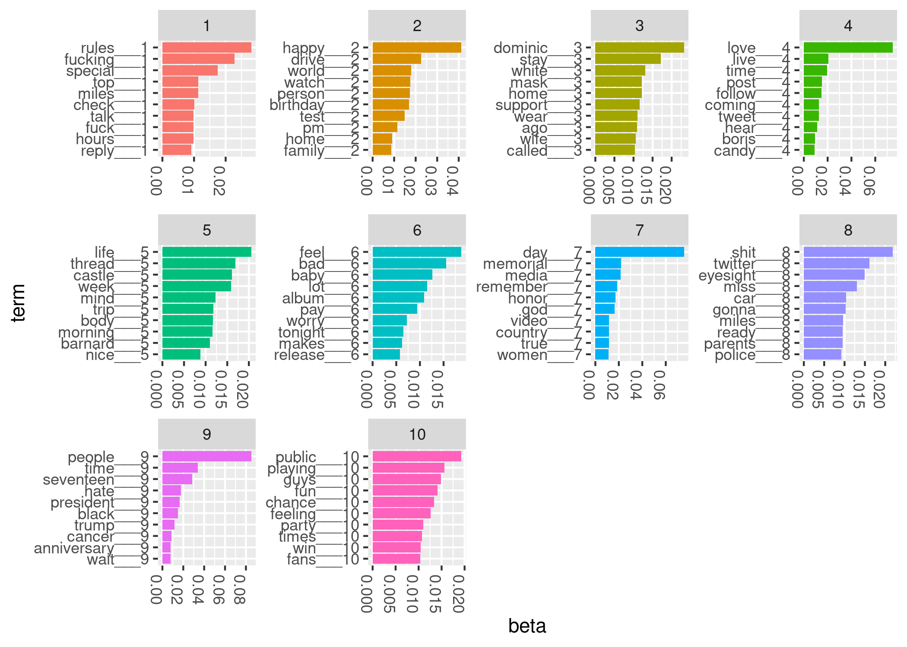

Last modified: `r params$lastmod`.

```{r child = "abstract.Rmd", eval = TRUE}
knitr::opts_chunk$set(echo = FALSE)
```


# Introduction

Twitter has profoundly changed how we communicate. 
In only 280 characters, users instantly contribute to public conversations on politics, 
current events, sports, media, and many other topics. 
Recent development of accessible statistical methods for large-scale text 
analysis now enable instructors to use tweets as contemporary pedagogical 
tools in guiding undergraduate research projects.
We report one instance of a mentored text analysis research project. 
We share our data and computer code to encourage others to undertake 
tweet text analysis research. We also describe our methods for creating a 
collection of tweets.

Some social media data, including tweets from Twitter, is
available through website application product interfaces (APIs). 
By way of a streaming API, Twitter shares a sample of approximately one percent of all 
tweets during an API query time period [@tweet_stream]. Any Twitter user can freely 
access this one percent sample, whereas access to a larger selection is available to researchers for a fee.


Using large collections of tweets, scholars have studied diverse research questions, including
the inference of relationships and social networks among Twitter users [@lin2011joint]; 
authorship of specific tweets when multiple persons share a single account [@drob]; and 
rhetoric in recruiting political supporters [@pelled2018little;@wells2016trump].
Recognizing the potential utility of tweets for data science research and teaching, 
we created a collection of tweets over time by repeated querying of the Twitter streaming API.

In line with recent calls for students to work with real data [@nolan2010computing;@carver2016guidelines], our 
collection of tweets has served as a valuable resource in our mentoring 
of undergraduate data science research. 
Working with real data allows students to develop proficiency not 
only in statistical analysis,
but also in related data science skills, including data 
transfer from online sources, data storage, using data 
from multiple file formats, and communicating findings. 
Collaboratively asking and addressing novel questions with 
our collection of tweets gave mentored students 
opportunities to develop competency in all of these areas.


While our tweet collection enables us to address many possible research questions, the 
dynamic content of tweets over time particularly piqued our interest. Together, students and 
mentors hypothesized that high-profile social media events would generate a high volume of 
tweets, and that we would detect social media events through changes in tweet 
topic content over time. We present below 1) an approach for collecting tweets in real 
time and 2) methods for detecting social media 
events via latent Dirichlet allocation modeling of tweets and 3) suggestions for 
using tweets in research mentoring of undergraduate students.

# Backward design and learning objectives

## Backward design


## Learning objectives


# Preliminary research mentoring considerations

We collaboratively developed research goals with students through a series of discussions throughout the academic year. As trainees begin their senior research projects, we suggest that mentors discuss with them:

1. Student experience with data analysis software
1. Student research interests and goals


## Student experience with data analysis software

Student experience with data analysis software varies. In our statistics department, 
most students learn elementary R computing skills through class assignments. Some 
students, by concentrating in computer science, learn other data analysis software 
packages, such as Python. 
Those who do undergraduate statistics research often learn advanced topics in R
computing, such as R package assembly, documentation, and testing. Many develop 
expertise in linux computing and cluster computing, too. 


## Student research interests and goals

In our experience, student interests vary, and students' ability to articulate research goals 
may be limited. An initial brainstorming session may clarify their interests and encourage 
them to think critically about goals under the time constraints of their academic schedules. 
Additionally, we anticipate that sharing completed student project reports will guide student 
thinking about the scope of possible projects.

We mentored one student whose interest in financial time series and tweet sentiment analysis 
guided her project. A second student formulated a project around event detection from tweet 
time series.

## Time period

Our two students conducted their research projects during the 2015-2016 academic year. 
We recommend a full academic year for projects of this magnitude, although a one-semester 
project is possible. Our students presented their findings at the statistics department’s 
undergraduate poster session near the end of the 2015-2016 academic year.


# Methods


## Collecting tweets over time

We include here instructions for creating a tweet collection. First, we created a 
new account on Twitter. With these user credentials, we used the 
R package `rtweet` to query the API. Because we work with linux operating systems, we used the `crontab` software 
to repeatedly execute R code to submit API queries. Each 
query lasted five minutes. We timed the API queries so 
that there was no time lag between queries. We stored tweets resulting from API queries in their native JSON format. 

The R package `rtweet` 
provides functions that parse tweet JSON to R data frames. We then 
conducted all further analyses in R.

Setting up the query task with `crontab` is straightforward. On our computer, with 
Ubuntu 20.04 linux operating system, we opened a terminal and typed `crontab -e`. This 
opened a text file containing user-specified tasks. We added the following line to the 
bottom of the file:

```{bash, eval = FALSE}
*/5 * * * * R -e 'rtweet::stream_tweets(timeout = (60 * 5), 
parse = FALSE, file_name = paste0("~/work/mentoring/mentoring-framework/data/",
lubridate::now(), "-tweets"))'
```

Users may need to slightly amend the above line to conform to requirements of their operating system's `crontab`.

## Querying Twitter API to get complete tweets

Twitter API use agreements forbid users from sharing complete API query results. 
However, Twitter permits users to share tweet identification numbers. A user can 
then query a Twitter API to obtain complete tweet data. In our experience, this 
process is incomplete; that is, many tweets submitted to the Twitter API return 
no data. Additionally, on repeated querying of the API, different sets of tweets 
return data. This complicates our goal of making all analyses computationally 
reproducible. 

From our collection of tweets, we chose to analyze those sent on three consecutive 
days from May 24, 2020 to May 26, 2020. We wanted to see if we could use text analysis 
tools to detect a transient change in topics for Memorial Day (May 25, 2020).

To minimize the computing requirements, we 
limited our analysis to tweets sent during a five-minute period (12:00pm to 12:05pm Eastern time) every day. However, our methods are appropriate for much larger data sets.
We then submitted API queries to Twitter
to get the full content of tweets, including the tweet text.
In supplementary files, we provide the R code that we used to 
query the Twitter API to obtain full tweet content. 


## Tweet structure

```{r, echo = TRUE, message = FALSE}
data_dictionary <- readr::read_csv("../data/tweets-data-dictionary.csv")
```


Tweets are available from the Twitter API as Javascript Object Notation (JSON) objects. Every tweet consists 
of multiple key-value pairs. The number of fields per 
tweet depends on user settings, retweet status, and other factors [@tweet_json]. 
The 31 tweet key-value pairs belong to
`r length(unique(data_dictionary$Type))` distinct classes (Appendix 1). The 
classes are either vectors - numeric, logical, or character - or arrays assembled 
from the vector classes.

Below is an example of Tweet JSON. Every tweet features the keys "created\_at" (the time stamp), 
"id\_str" (a unique tweet identifier), and "text". We use these three keys in 
our analyses.


```{bash, eval = FALSE, fig.cap = "Example Tweet JSON"}
{
  "created_at": "Thu Apr 06 15:24:15 +0000 2017",
  "id_str": "850006245121695744",
  "text": "1\/ Today we\u2019re sharing our vision for the future of the Twitter API platform!",
  "user": {
    "id": 2244994945,
    "name": "Twitter Dev",
    "screen_name": "TwitterDev",
    "location": "Internet",
    "url": "https:\/\/dev.twitter.com\/",
    "description": "Your official source for Twitter Platform news, updates & events. 
    Need technical help? Visit https:\/\/twittercommunity.com\/ \u2328\ufe0f 
    #TapIntoTwitter"
  },
  "place": {   
  },
  "entities": {
    "hashtags": [      
    ],
    "urls": [
      {
        "url": "https:\/\/t.co\/XweGngmxlP",
        "unwound": {
          "url": "https:\/\/cards.twitter.com\/cards\/18ce53wgo4h\/3xo1c",
          "title": "Building the Future of the Twitter API Platform"
        }
      }
    ],
    "user_mentions": [     
    ]
  }
}
```

Our analyses use three fields from each tweet: date ("created_at"), tweet identifier 
("id_str"), and tweet text ("text"). The "created_at" field is a character string containing 
the date and time of the tweet. Every tweet has a unique identifier, the "id_str" value. The 
"text" field contains the unicode representation of the message. For our topic modeling, a single day defines a single "corpus", and a single tweet 
corresponds to a single "document". 


## Parsing tweet text

We used functions from the `rtweet` R package to parse tweet JSON into a data frame [@rtweet-package]. 
We then divided tweet text into words with functions from the `tidytext` R package [@tidytext]. We 
discarded commonly used "stop words" and emojis. 

Latent Dirichlet allocation models require that the corpus be inputted as a 
document by term matrix. In a document by term matrix, each row corresponds to a single document (a single 
tweet), and each column is a single term (or word). Each cell contains a 
count (the number of 
occurrences of a term in the specified document). We created a document by 
term matrix with the R function `cast_dtm` from the `tidytext` package.

## Latent Dirichlet allocation

Latent Dirichlet allocation is a statistical method for inferring latent (unobservable) topics (or themes)
from a large corpus (or collection) of documents [@blei2003latent].
We pretend that there's an imaginary process for creating documents in the corpus. For each document,
we choose a discrete distribution over topics. For example, some tweets from Memorial Day may 
refer to the holiday. This may constitute one topic in the corpus. 
Having chosen a distribution over topics, we then select document words by first 
drawing a topic from the distribution over topics, then drawing a word from the
chosen topic. 
Thus, a topic is technically defined as a distribution over words in a fixed vocabulary (or collection of words) [@blei2003latent].


## Study design

We sought to validate our hypothesis that we could detect a social 
media event by examining tweet topic content at distinct time periods. 
As a proof of principle of our event detection strategy, we chose to 
analyze tweets before, during, and after Memorial Day (May 25, 2020). We fitted latent Dirichlet allocation models for each of three
distinct five-minute periods. The first period began at noon Eastern time on May 24, 2020. Subsequent time periods started 
24 and 48 hours later. 
We defined each time period to be a single collection, or corpus, of tweets. We then fitted latent 
Dirichlet allocation models to each corpus. 

# Results

We identified the top ten terms for each of ten topics in our models. We plotted 
the within-topic word probabilities as bar graphs.

```{r, fig.cap = "Top terms for LDA model from May 24, 2020"}
knitr::include_graphics("../results/beta-2020-05-24.png")
```

```{r, fig.cap = "Top terms for LDA model from May 25, 2020 (Memorial Day)"}

```

```{r, fig.cap = "Top terms for LDA model from May 26, 2020"}
knitr::include_graphics("../results/beta-2020-05-26.png")
```

Assigning meaning to topics is an active research area [@chang2009reading]. Since
our interest is in the transient appearance of a new topic, we don't attempt to
assign meaning to topics in our models.

We see that topic 7 from May 25 has several words that suggest Memorial Day: 
memorial, remember, honor, country. A similar topic is not seen on May 24 or May 26.

Some topics persist, possibly with distinct word probabilities, across the three days. For example, we see that President Trump features prominently in all three models.

We also note, on May 26, topic 10, which reflects discussion of the Amy Cooper Central Park incident. 

We found evidence that latent Dirichlet allocation summarizes elements of 
large collections of Twitter conversations. 

# Assessment of learning, exploring more advanced topics, and concluding remarks

## Assessment of learning

We examined student learning through both formative and summative assessments.
We conducted formative assessments through weekly discussions with students.
In these discussions, we developed action items to advance research progress and overcome challenges. 

We summatively assessed student achievement at the end of the academic year. Both
students wrote a thesis and presented a poster to our statistics department. 
We asked questions at the poster session to probe student understanding and critically
evaluated the theses. 

In future iterations, we will use a written rubric to grade student theses. We'll
share the rubric with our students at the start of the academic year.

## Exploring more advanced topics

Twitter data over time offers a wealth of potential research projects. Supplementing 
tweets with public data from other sources multiplies the possibilities. For example, 
one of our two students supplemented tweets with daily stock market index prices. 
She studied sentiment of finance-related tweets and daily stock market index
closing prices.

Latent Dirichlet allocation modeling and related methods are a major research area in the 
quantitative social sciences. Advanced students with interest in statistical computing might
compare inferential methods for topic models. Those with interests in event detection
and time series analysis could build on the findings of our student by explicitly accounting
for topic evolution with dynamic topic models [@blei2006dynamic].

## Concluding remarks

Tweet collections over time are a rich, large, authentic data set that offer 
many opportunities for student research projects. We provided 
instructions to enable readers to 
establish their own tweet collections. We also presented details for one 
mentored research project that made use of our stored tweets.

Tweet analysis gives students practical experience in the data science process of 
formulating a research question, gathering data to address it, summarizing the 
data, visualizing results, and communicating findings.


# Acknowledgements

The authors thank Betsy Colby Davie and Rick Nordheim for helpful discussions and 
feedback on preliminary versions of the manuscript. We thank the special issue 
editors and anonymous reviewers for their constructive comments and suggestions.


# References

<div id="refs"></div>

\newpage

# Appendix 1: Tweet data dictionary

Twitter shares a data dictionary for tweets (https://developer.twitter.com/en/docs/tweets/data-dictionary/overview/tweet-object,  (Accessed: May 23, 2020)). We have saved it as a supplementary file, "tweets-data-dictionary.csv".

\newpage


# Appendix 2: R analysis code

